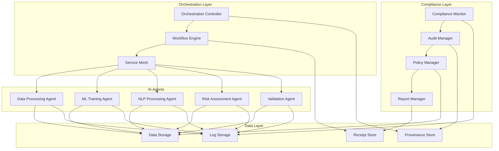
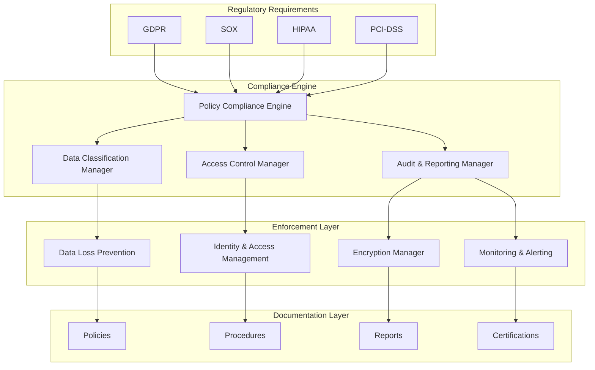
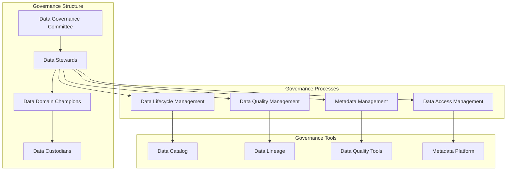
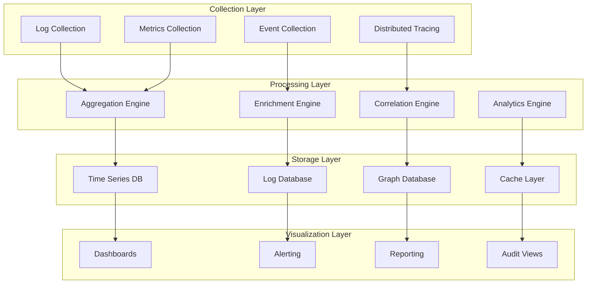
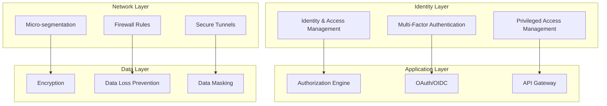

# AI Agents Orchestration and Compliance Framework

This document provides comprehensive documentation for the cross-agent orchestration model and compliance framework implemented in this repository.

## Table of Contents

1. [Overview](#overview)
2. [Architecture](#architecture)
3. [Cross-Agent Orchestration Model](#cross-agent-orchestration-model)
4. [Compliance Framework](#compliance-framework)
5. [Data Governance](#data-governance)
6. [Monitoring and Observability](#monitoring-and-observability)
7. [Security Model](#security-model)
8. [Integration Patterns](#integration-patterns)

## Overview

The AI Agents Data and Logs repository implements a comprehensive orchestration and compliance framework designed to manage multiple AI agents in a distributed environment. This system ensures:

- **Coordinated Multi-Agent Operations**: Seamless interaction between diverse AI agents
- **Complete Audit Trails**: Full visibility into agent activities and decisions
- **Regulatory Compliance**: Built-in compliance with GDPR, SOX, HIPAA, and other regulations
- **Data Provenance**: Complete lineage tracking for all data transformations
- **Security and Privacy**: End-to-end security with privacy-by-design principles

## Architecture



## Cross-Agent Orchestration Model

### 1. Orchestration Components

#### Orchestration Controller
- **Purpose**: Central coordination of multi-agent workflows
- **Responsibilities**:
  - Workflow definition and execution
  - Agent lifecycle management
  - Resource allocation and scaling
  - Error handling and recovery
  - Cross-agent communication coordination

#### Workflow Engine
- **Purpose**: Execute complex multi-step workflows
- **Features**:
  - Sequential and parallel execution patterns
  - Conditional branching and loops
  - Error handling and retry mechanisms
  - Workflow versioning and rollback
  - Dynamic workflow modification

#### Service Mesh
- **Purpose**: Inter-agent communication infrastructure
- **Capabilities**:
  - Service discovery and registration
  - Load balancing and failover
  - Circuit breaker patterns
  - Distributed tracing
  - Security policy enforcement

### 2. Agent Interaction Patterns

#### Sequential Pattern
```yaml
workflow:
  name: "data-processing-pipeline"
  pattern: "sequential"
  steps:
    - agent: "data-validation-agent"
      action: "validate-input"
      timeout: "5m"
    - agent: "data-transformation-agent"
      action: "transform-data"
      timeout: "15m"
    - agent: "ml-training-agent"
      action: "train-model"
      timeout: "60m"
```

#### Parallel Pattern
```yaml
workflow:
  name: "parallel-analysis"
  pattern: "parallel"
  branches:
    - name: "risk-assessment"
      agent: "risk-assessment-agent"
      action: "analyze-risk"
    - name: "fraud-detection"
      agent: "fraud-detection-agent"
      action: "detect-fraud"
    - name: "compliance-check"
      agent: "compliance-agent"
      action: "verify-compliance"
  coordination: "wait-all"
```

#### Event-Driven Pattern
```yaml
workflow:
  name: "event-driven-processing"
  pattern: "event-driven"
  triggers:
    - event: "data.received"
      agent: "data-processor"
      action: "process-data"
    - event: "processing.completed"
      agent: "quality-checker"
      action: "validate-quality"
    - event: "validation.passed"
      agent: "publisher"
      action: "publish-results"
```

### 3. Agent Communication Protocol

#### Message Format
```json
{
  "message_id": "msg-20241219-103045-001",
  "correlation_id": "corr-workflow-001",
  "trace_id": "trace-data-pipeline-001",
  "timestamp": "2024-12-19T10:30:45.123Z",
  "source_agent": "agent-data-001",
  "target_agent": "agent-ml-001",
  "message_type": "workflow.task.assignment",
  "payload": {
    "task_id": "task-001",
    "operation": "train-model",
    "parameters": {
      "dataset_id": "training-data-v1.2",
      "model_type": "neural-network"
    },
    "timeout": 3600,
    "retry_policy": {
      "max_retries": 3,
      "backoff_multiplier": 2
    }
  },
  "security": {
    "signature": "MEQCIBc7...",
    "encryption": "AES-256-GCM",
    "authentication": "oauth2"
  }
}
```

#### Response Format
```json
{
  "response_id": "resp-20241219-103055-001",
  "correlation_id": "corr-workflow-001",
  "trace_id": "trace-data-pipeline-001",
  "timestamp": "2024-12-19T10:30:55.456Z",
  "source_agent": "agent-ml-001",
  "target_agent": "agent-data-001",
  "message_type": "workflow.task.acknowledgment",
  "status": "accepted",
  "payload": {
    "task_id": "task-001",
    "estimated_completion": "2024-12-19T11:30:45.123Z",
    "resource_requirements": {
      "cpu": "4",
      "memory": "8Gi",
      "gpu": "1"
    }
  }
}
```

## Compliance Framework

### 1. Regulatory Compliance Architecture



### 2. Data Classification Framework

#### Classification Levels
1. **Public**: Freely shareable information
2. **Internal**: Internal business information
3. **Restricted**: Sensitive business information
4. **Confidential**: Highly sensitive information

#### Classification Criteria
```yaml
classification_rules:
  personal_data:
    level: "restricted"
    regulations: ["GDPR", "CCPA"]
    retention: "varies_by_jurisdiction"
    encryption_required: true
    
  financial_data:
    level: "confidential" 
    regulations: ["SOX", "PCI-DSS"]
    retention: "7_years"
    encryption_required: true
    
  health_data:
    level: "confidential"
    regulations: ["HIPAA", "HITECH"]
    retention: "6_years"
    encryption_required: true
    
  public_data:
    level: "public"
    regulations: []
    retention: "as_needed"
    encryption_required: false
```

### 3. Privacy by Design Implementation

#### Core Principles
1. **Proactive not Reactive**: Privacy built into system design
2. **Privacy as the Default**: Maximum privacy protection without user action
3. **Full Functionality**: All features work with privacy protection
4. **End-to-End Security**: Complete lifecycle protection
5. **Visibility and Transparency**: Open privacy practices
6. **Respect for User Privacy**: User-centric privacy protection

#### Implementation Examples
```yaml
privacy_controls:
  data_minimization:
    - collect_only_necessary_data
    - automatic_data_expiration
    - purpose_limitation_enforcement
    
  consent_management:
    - granular_consent_options
    - consent_withdrawal_mechanisms
    - consent_audit_trails
    
  anonymization:
    - automatic_pii_detection
    - data_pseudonymization
    - k_anonymity_enforcement
    
  right_to_erasure:
    - data_deletion_workflows
    - tombstone_record_maintenance
    - third_party_deletion_coordination
```

## Data Governance

### 1. Data Governance Framework



### 2. Data Quality Management

#### Data Quality Dimensions
- **Accuracy**: Data correctly represents real-world entities
- **Completeness**: All required data is present
- **Consistency**: Data is uniform across systems
- **Timeliness**: Data is up-to-date and available when needed
- **Validity**: Data conforms to defined formats and constraints
- **Uniqueness**: No inappropriate duplicate records exist

#### Quality Metrics
```yaml
quality_metrics:
  accuracy:
    measurement: "percentage_correct_values"
    target: ">95%"
    monitoring: "continuous"
    
  completeness:
    measurement: "percentage_populated_fields"
    target: ">98%"
    monitoring: "daily"
    
  consistency:
    measurement: "cross_system_variance"
    target: "<2%"
    monitoring: "weekly"
    
  timeliness:
    measurement: "data_freshness"
    target: "<1_hour"
    monitoring: "real_time"
```

## Monitoring and Observability

### 1. Observability Stack



### 2. Key Performance Indicators (KPIs)

#### Operational KPIs
```yaml
operational_kpis:
  availability:
    metric: "system_uptime_percentage"
    target: ">99.9%"
    alert_threshold: "<99.5%"
    
  performance:
    metric: "average_response_time"
    target: "<100ms"
    alert_threshold: ">200ms"
    
  throughput:
    metric: "requests_per_second"
    target: ">1000"
    alert_threshold: "<500"
    
  error_rate:
    metric: "error_percentage"
    target: "<0.1%"
    alert_threshold: ">0.5%"
```

#### Compliance KPIs
```yaml
compliance_kpis:
  audit_coverage:
    metric: "percentage_audited_transactions"
    target: "100%"
    alert_threshold: "<99%"
    
  policy_compliance:
    metric: "policy_violation_rate"
    target: "0%"
    alert_threshold: ">0.1%"
    
  data_quality:
    metric: "data_quality_score"
    target: ">95%"
    alert_threshold: "<90%"
    
  security_incidents:
    metric: "incidents_per_month"
    target: "0"
    alert_threshold: ">1"
```

## Security Model

### 1. Zero Trust Architecture



### 2. Security Controls Matrix

| Control Category | Control | Implementation | Compliance |
|-----------------|---------|----------------|------------|
| Identity | Authentication | OAuth 2.0 + OIDC | SOX, GDPR |
| Identity | Authorization | RBAC + ABAC | SOX, HIPAA |
| Network | Encryption | TLS 1.3 | PCI-DSS |
| Network | Segmentation | Zero Trust | All |
| Application | Input Validation | Schema Validation | All |
| Application | Output Encoding | Context-aware | OWASP |
| Data | Encryption at Rest | AES-256 | All |
| Data | Encryption in Transit | TLS 1.3 | All |

## Integration Patterns

### 1. API Integration

#### RESTful API Design
```yaml
api_design_principles:
  resource_based: true
  stateless: true
  cacheable: true
  uniform_interface: true
  layered_system: true
  
versioning:
  strategy: "url_path"
  format: "/api/v{major}.{minor}"
  backward_compatibility: "2_versions"
  
authentication:
  method: "oauth2_bearer_token"
  token_expiry: "1_hour"
  refresh_enabled: true
  
rate_limiting:
  default_limit: "1000_requests_per_hour"
  burst_limit: "100_requests_per_minute"
  throttling_strategy: "sliding_window"
```

#### GraphQL Integration
```graphql
type Agent {
  id: ID!
  name: String!
  type: AgentType!
  version: String!
  status: AgentStatus!
  configuration: JSON
  metrics: AgentMetrics
  receipts: [Receipt!]!
  provenance: [ProvenanceRecord!]!
}

type Query {
  agents(filter: AgentFilter): [Agent!]!
  agent(id: ID!): Agent
  workflows(status: WorkflowStatus): [Workflow!]!
  auditTrail(agentId: ID!, timeRange: TimeRange): [AuditRecord!]!
}

type Mutation {
  deployAgent(manifest: AgentManifest!): DeploymentResult!
  executeWorkflow(definition: WorkflowDefinition!): WorkflowExecution!
  updateConfiguration(agentId: ID!, config: JSON!): UpdateResult!
}
```

### 2. Event-Driven Integration

#### Event Schema
```json
{
  "event_id": "evt-20241219-103045-001",
  "event_type": "agent.workflow.completed",
  "event_version": "1.0",
  "timestamp": "2024-12-19T10:30:45.123Z",
  "source": {
    "service": "orchestration-controller",
    "agent_id": "agent-coordinator-001",
    "version": "2.1.0"
  },
  "subject": {
    "workflow_id": "wf-customer-onboarding-001",
    "correlation_id": "corr-onboarding-cust-56789"
  },
  "data": {
    "workflow_status": "completed",
    "execution_time": "22m30.789s",
    "agents_involved": 3,
    "success_rate": 1.0,
    "compliance_verified": true
  },
  "metadata": {
    "trace_id": "trace-workflow-onboarding-001",
    "span_id": "span-orchestrator-001",
    "baggage": {
      "business_unit": "customer-acquisition",
      "cost_center": "digital-onboarding"
    }
  }
}
```

---

This documentation provides a comprehensive overview of the AI Agents Orchestration and Compliance Framework. For specific implementation details, refer to the code examples and configuration files in this repository.